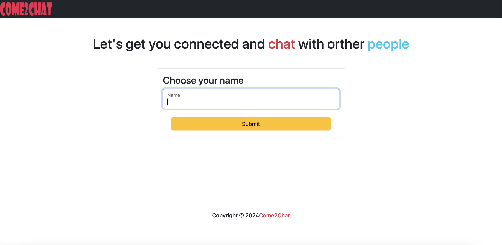
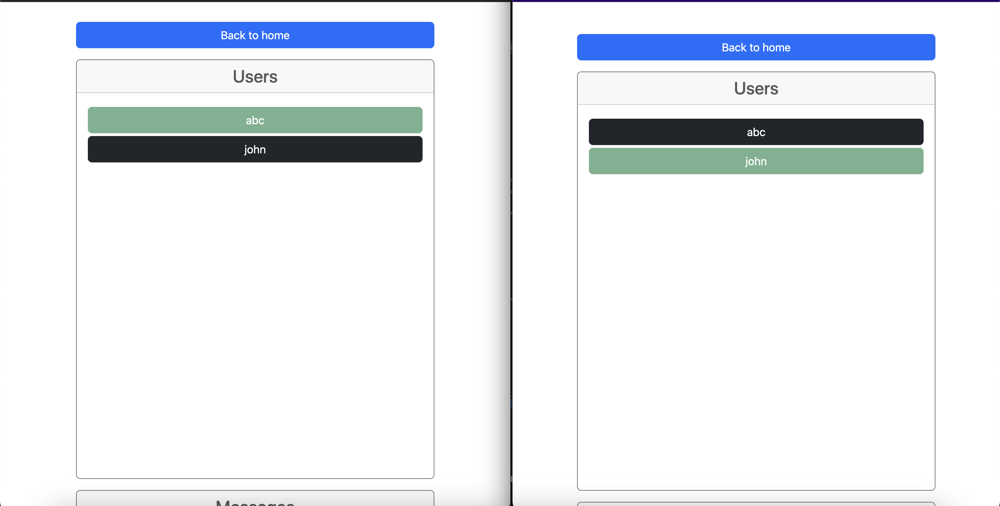
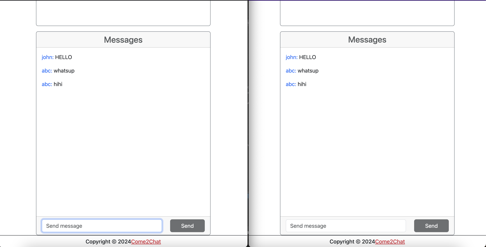

# Chat-Web-Application-.NET-Angular

This project is a hands-on guide to building a real-time chat application using .NET 7, Angular 14, and SignalR. Designed for developers, this application showcases how to create a scalable, interactive chat system with various features like user status updates, message threading, and real-time communication.

# Screenshot
<div style="display: flex; justify-content: center; gap: 20px;">
  
  
</div>
<div style="text-align: center; margin-top: 20px;">
  
</div>


## Features

- **Real-time Messaging**: Supports both public and private messages.
- **User Status Tracking**: Displays and updates online users in real time.
- **Responsive UI**: Designed with Angular for a seamless user experience on any device.
- **Authentication & Authorization**: Manages user sessions and secure data exchange.
- **Production-Ready**: Includes build and deployment scripts for Azure or similar platforms.

## Technologies

- **Backend**: .NET 7 with SignalR for real-time functionality.
- **Frontend**: Angular 14 for a dynamic, responsive user interface.
- **Deployment**: Azure for cloud deployment.

## Setup and Installation

### Prerequisites

Ensure the following are installed:

- .NET 7 SDK
- Node.js (with npm)
- Angular CLI

### Steps

1. **Clone the repository**:
   ```bash
   git clone https://github.com/shayanvaghei/Come2...
   cd Come2Chat
   ```
2. **Backend Setup**:
- Navigate to the backend project folder.
- Restore dependencies and build the API.
 ```bash
  dotnet restore
  dotnet build
  ```
3. Frontend Setup:
- Go to the ClientApp folder.
- Install dependencies and run the development server.
  ```bash
  npm install
  ng serve
  ```
## Project Structure
- API: Contains the .NET 7 backend project, including ChatService, ChatController, and ChatHub.
- ClientApp: Contains the Angular frontend project with components for chat functionality, forms, and user interfaces.
